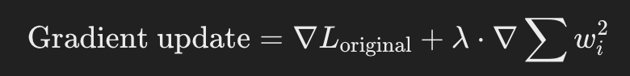

## Optimzers

They adjust the learning rate, and the learning is used in backpropagation to modify the weights and biases to reduce loss function.

### Adam

Combines the benefits of momentum and adaptive learning rates.

- Momentum: accelerates gradient descent by adding previous update (gradient) to current one.

- Adaptive learning rate: learning rate is adjusted based on the progress of weight updates. (large gradients get smaller updates and vice versa)

### SGD (Stochastic gradient descent)

- Acts like normal gradient descent, difference is that is introduces randomness, by using batches of training data.

### RMSProp (Root Mean Square Propagation)

- maintains a moving average of the squared gradients, giving more weight to recent gradients.
- avoids rapid learning rate decay.

## Loss function vs Cost function

Measures True - Prediction with a mathematical equation.

- loss function: Measure model error on a single instance
- cost function: Measure model error on a group of data

## Learning rate scheduler

Adjusts learning rate between epochs.

ps: while optimizers also change learning rate, optimizers control local learning rate and learning rate scheduler controls global learning rate.

- global learning rate: A single learning rate value applied to all parameters.
- local learning rate: Learning rates that vary per parameter based on individual gradients.

### Step Decay Scheduler

reduces learning rate by a factor after a fixed number of epochs.

etc. reduce learning rate by 10% evey 10 epochs.

### Exponential Decay

Gradually decreases the learning rate following an exponential function.

### Cyclical Learning Rate

Cycles the learning rate between a lower and upper bound by using a step size.

**(More can be added)**

## L2 Regularization

- penalizes high value coefficients. (Adds a term)
- helps prevent overfitting
- the argument it takes makes the gradient smaller by multiplying it with sum of all weights sqaured

## Definitions

- Learning rate: number that sets how quickly a model converges.
- dropout rate: probability of dropping out neurons during training, it helps prevent overfitting; if the model; if the model overfits with a specific neuron, it can be dropped out (Setting to zero) so it doesnt make any effect